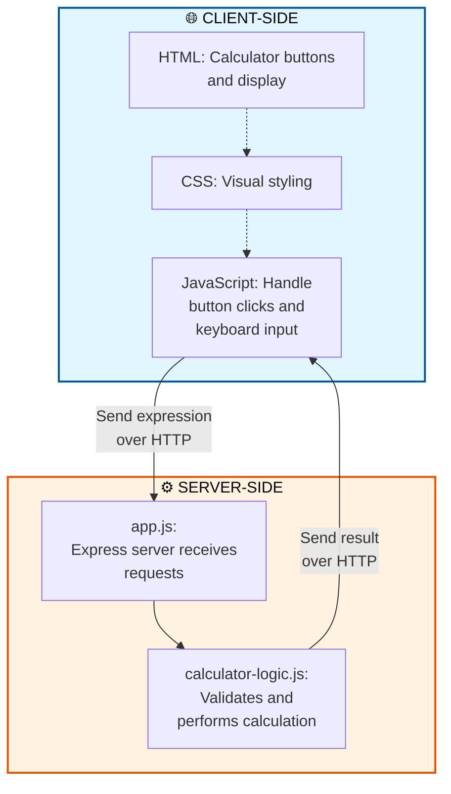

# CougarCalc Project Structure Guide

This guide maps the actual files and folders in the CougarCalc project to the architecture diagrams in the README.md. It will help you understand where each part of the app lives in the code.

## Project Folder Map

Here's what each folder and file does and how it connects to the architecture:

```
cougarcalc/
├── app.js                      ← Express Server (Backend)
├── package.json                ← Project configuration
├── debug-check.js              ← Debugging utility
├── public/                     ← Frontend (Browser)
│   ├── index.html              ← Calculator UI & Frontend JavaScript
│   └── calculator-logic.js     ← Calculator Logic (shared)
├── test/                       ← Testing
│   ├── app.test.js
│   └── calculator-logic.test.js
├── logs/                       ← Data storage
│   └── user-requests.csv
└── docs/                       ← Documentation
```

## How Files Map to the Architecture Diagrams

The README.md shows three diagrams. Here's how the files align with each:

### 1. Architecture Diagram
```
User → Browser → Frontend JavaScript → Express Server → Calculator Logic
```

**Mapped to files:**

- **User**: You, using the app
- **Browser**: The web browser on your computer
- **Frontend JavaScript** = `public/index.html` + `public/calculator-logic.js`
  - The HTML file contains the calculator interface and JavaScript code that runs in the browser
  - Handles button clicks and keyboard input
  - Sends the calculation request to the server
  - Displays results and history
- **Express Server** = `app.js`
  - Receives requests from the browser
  - Processes them and sends responses back
- **Calculator Logic** = `public/calculator-logic.js` (called by `app.js`)
  - Performs the actual arithmetic calculations
  - Validates and sanitizes the user's input

### 2. Basic Sequence Diagram
```
User → Browser → Express Server → Result → Browser → User
```

**Mapped to files:**

The request flow happens like this:
1. You click a button in `public/index.html`
2. JavaScript in `public/index.html` runs and calls `public/calculator-logic.js`
3. The browser sends the expression to `app.js` (the Express server)
4. `app.js` uses `public/calculator-logic.js` to evaluate it
5. `app.js` sends the result back to the browser
6. JavaScript in `public/index.html` displays the answer

### 3. Detailed Sequence Diagram
```
Browser → Express Server (read request) → Calculator Logic (validate & compute) → Express Server → Browser
```

**Mapped to files:**

- **Browser sends request**: `public/index.html` makes a POST request to `/calculate`
- **Express Server reads request**: `app.js` receives the request in the `/calculate` route
- **Calculator Logic validates & computes**: `app.js` calls functions from `public/calculator-logic.js`
  - Sanitizes the input
  - Validates the expression
  - Calculates the result
- **Express Server responds**: `app.js` sends the result back as JSON
- **Browser displays**: `public/index.html` receives the JSON and updates the display

## Client-Side vs Server-Side Code

One of the most important concepts for understanding web apps is knowing **where code runs**.

### The Key Difference

- **Client-side code** runs on *your computer* in your web browser
- **Server-side code** runs on *a different computer* that serves the web pages

### Development vs Production

**During Development (running locally on your laptop):**
- Client-side code: Runs in your browser
- Server-side code: Runs in Node.js on your same laptop
- Communication: Happens via HTTP on `localhost:3000`

**In Production (deployed to AWS or another cloud provider):**
- Client-side code: Still runs in your browser (or any user's browser)
- Server-side code: Runs on AWS servers (e.g., Elastic Beanstalk or Lightsail)
- Communication: Happens via HTTP over the internet to your AWS domain

In both cases, the client-side and server-side code are separate and communicate using HTTP. The main difference is *where* the server-side code runs.

### Where Code Runs in CougarCalc (Development Environment)

The diagram below shows how the code runs when you're developing locally. On the left is the client-side code (in your browser). On the right is the server-side code (Node.js running on your laptop during development).



**During Development:** 
- **Client-side** (left): Runs in your web browser on your laptop
- **Server-side** (right): Runs in Node.js on your same laptop
- Communication: HTTP over `localhost:3000`

**In Production (deployed to AWS):**
- **Client-side** (left): Still runs in web browsers (unchanged)
- **Server-side** (right): Runs on AWS servers instead of your laptop
- Communication: HTTP over the internet to your AWS domain

### Client-Side: `public/index.html`

This file runs **in your browser** and includes:

- **HTML**: Defines the structure (buttons, display screen, etc.)
- **CSS**: Makes it look like a calculator
- **JavaScript**: Makes it interactive
  - Listens for your button clicks and keyboard input
  - Updates the display in real-time
  - Sends requests to the server
  - Receives responses and displays the results

**You experience this directly** — you see it, click it, and interact with it.

### Server-Side: `app.js` and `public/calculator-logic.js`

This code runs **on the server** (Node.js) and includes:

- **app.js**: The Express framework
  - Receives HTTP requests from the browser
  - Routes them to the right handler
  - Sends HTTP responses back
- **calculator-logic.js** (called by app.js): The calculation engine
  - Validates the expression
  - Performs the math
  - Returns the result

**You don't see this directly** — it works behind the scenes.

### Why Both?

You might wonder: "If JavaScript can do calculations in the browser (`public/index.html`), why do we send it to the server (`app.js`)?"

Good question! Here are the reasons:

1. **Security**: The server validates and sanitizes input to prevent malicious code
2. **Consistency**: The official answer comes from the server, not the browser
3. **Logging**: The server can record what calculations users are doing
4. **Scalability**: Complex apps might need server power for heavy calculations
5. **Data persistence**: The server can save information to a database

In CougarCalc, this separation keeps the code clean and teaches you how real web apps work.

### Summary: The Flow

1. **You click a button** (happens in the browser, client-side)
2. **Browser JavaScript responds** (client-side) by building the expression
3. **Browser sends the expression to the server** (communication over HTTP)
4. **Server JavaScript processes it** (server-side) and calculates the result
5. **Server sends the result back** (communication over HTTP)
6. **Browser JavaScript receives it** (client-side) and updates the display
7. **You see the answer** (happens in the browser, client-side)

### Important: Development vs Production Deployment

**While developing on your laptop:**
- When you run `npm start`, Node.js starts the server on your machine
- You access it at `http://localhost:3000`
- Both client and server code are on the same machine, but they're still separate

**When deployed to AWS (or any cloud server):**
- Your `public/` folder (client-side code) gets served by the AWS server
- Your `app.js` (server-side code) runs on the AWS server
- Users access it via your domain name (e.g., `www.mycalculator.com`)
- The HTTP communication between browser and server happens over the internet instead of locally
- The code flow remains the same — only the physical location changes

This is one of the beautiful things about web apps: the same code works whether deployed locally or globally!

## Detailed File Descriptions

### Backend Files

#### `app.js` (Express Server)
- **What it does**: Starts the web server and handles all incoming requests
- **Key responsibilities**:
  - Creates the Express app and listens on port 3000
  - Serves static files (HTML, CSS, JavaScript) from the `public/` folder
  - Defines the `/calculate` route that receives calculation requests
  - Logs user requests to `logs/user-requests.csv`
  - Calls `public/calculator-logic.js` to perform calculations
- **How to find it**: Opens when you run `npm start`
- **Maps to diagram**: The "Express Server" box

#### `package.json` (Project Configuration)
- **What it does**: Describes the project and lists dependencies
- **Key info**:
  - `"main": "app.js"` — tells Node.js to run app.js as the entry point
  - `"dependencies"` lists Express (the framework `app.js` uses)
  - `"scripts"` defines `npm start` (runs app.js) and `npm test`
- **Used by**: npm when you run `npm install` or `npm start`

### Frontend Files

#### `public/index.html` (Calculator UI & Browser JavaScript)
- **What it does**: The entire user interface that you see in the browser
- **Key parts**:
  - HTML structure defines the layout (display screen, buttons, etc.)
  - CSS (inside the `<style>` tag) makes it look like a calculator
  - JavaScript (inside `<script>` tag) handles interactions:
    - Listens for button clicks and keyboard input
    - Builds the expression string
    - Sends requests to the server at `app.js`
    - Receives results and updates the display
    - Manages the calculation history
- **How to see it**: Open http://localhost:3000 in your browser
- **Maps to diagram**: The "Browser" box + the "Frontend JavaScript" box

#### `public/calculator-logic.js` (Calculator Logic)
- **What it does**: The core calculation engine
- **Key responsibilities**:
  - `appendValue()` — adds numbers and operators to the current expression
  - `sanitizeExpression()` — removes dangerous characters
  - `evaluateExpression()` — performs the actual calculation
  - `clearAll()` — resets everything
- **Used by**:
  - `index.html` (runs in the browser)
  - `app.js` (runs on the server)
- **Why both places?** The logic can run both in the browser (for instant feedback) and on the server (for the official calculation)
- **Maps to diagram**: The "Calculator Logic" box

### Testing Files

#### `test/app.test.js` (Server Tests)
- **What it does**: Automated tests that verify the Express server works correctly
- **Tests**: Send calculation requests to `app.js` and check that responses are correct
- **Run with**: `npm test`
- **Why it's important**: Catches bugs before they reach users

#### `test/calculator-logic.test.js` (Logic Tests)
- **What it does**: Tests the `public/calculator-logic.js` functions
- **Tests**: Verify that calculations are correct, edge cases work, and invalid input is handled
- **Run with**: `npm test`

### Data Storage

#### `logs/user-requests.csv` (Request Log)
- **What it does**: Records information about each request
- **Data includes**: timestamp, local address, port, remote address, port
- **Updated by**: `app.js` (via middleware that runs on every request)
- **Used for**: Understanding how the app is being used

### Utilities & Documentation

#### `debug-check.js`
- **What it does**: A utility to test/debug the app
- **Usage**: Run manually if you need to verify something is working

#### `docs/` folder
- **README.md** — Beginner-friendly explanation of how the app works
- **ProjectStructureGuide.md** — This file! Explains the folder structure
- **RunningTheApp.md** — Instructions for running the app
- **bugs-enhancements.md** — Known issues and potential improvements
- **resolved-bugs-enhancements.md** — Fixes that have been applied

## Request Flow Example

Let's trace a calculation through the files step-by-step:

1. **You enter "2 + 3" and press Calculate**
   - This happens in `public/index.html` (the browser interface)

2. **Browser sends the expression to the server**
   - JavaScript in `public/index.html` makes a POST request to `/calculate`
   - Sends: `{ expression: "2 + 3" }`

3. **Server receives the request**
   - `app.js` receives it at the `/calculate` route
   - Logs the request to `logs/user-requests.csv`

4. **Server calculates**
   - `app.js` calls a function from `public/calculator-logic.js`
   - That function:
     - Sanitizes: checks for dangerous characters
     - Validates: ensures it's a valid expression
     - Evaluates: computes `2 + 3 = 5`

5. **Server sends response**
   - `app.js` sends back: `{ result: 5 }`

6. **Browser receives and displays**
   - JavaScript in `public/index.html` gets the result
   - Updates the display to show "5"
   - Adds "2 + 3 = 5" to the calculation history

## Summary

| Diagram Component | File(s) |
|---|---|
| User | You |
| Browser | Web browser on your computer |
| Frontend JavaScript | `public/index.html` + `public/calculator-logic.js` |
| Express Server | `app.js` |
| Calculator Logic | `public/calculator-logic.js` |
| Tests | `test/app.test.js` and `test/calculator-logic.test.js` |
| Config | `package.json` |
| Logs | `logs/user-requests.csv` |

Now when you look at the code, you'll know which file handles which part of the app!
