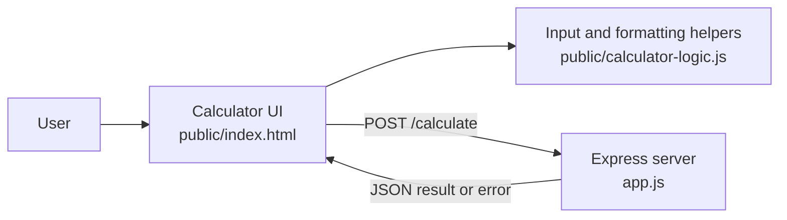

# CougarCalc Project Structure Guide

This guide maps the current CougarCalc files to the parts of the application.

## Project folder map

```text
cougarcalc/
├── app.js
├── debug-check.js
├── package.json
├── package-lock.json
├── cougar-icon-v1.png
├── cougar-icon-v2.png
├── public/
│   ├── index.html
│   └── calculator-logic.js
├── test/
│   ├── app.test.js
│   └── calculator-logic.test.js
├── bruno/
│   └── CougarCalcCollection/
└── docs/
    ├── README.md
    ├── ProjectStructureGuide.md
    ├── RunningTheApp.md
    ├── open-bugs-enhancements.md
    └── resolved-bugs-enhancements.md
```

Generated dependencies in `node_modules/` are not shown.

## Architecture

CougarCalc has a browser frontend and an Express backend:



The two JavaScript areas have different responsibilities:

- `public/calculator-logic.js` runs in the browser. It builds the expression as the user presses buttons and formats results for display.
- `app.js` runs in Node.js. It validates and evaluates submitted expressions and returns JSON responses.

The server does not import `public/calculator-logic.js`.

## Client-side code

### `public/index.html`

This file contains the calculator's HTML, CSS, and browser JavaScript. It:

- displays the calculator, hosting-environment badge, and recent history;
- handles number, operator, decimal, parenthesis, clear, backspace, and equals controls;
- supports keyboard input;
- sends `{ "expression": "..." }` to `POST /calculate`;
- requests the hosting label from `GET /environment`; and
- displays successful results or an error state.

Calculation history exists only in the current browser page and is limited to eight entries.

### `public/calculator-logic.js`

This browser-compatible module exports:

- `appendValue(currentFormula, value)`, which builds the displayed expression and handles initial zeroes, double zeroes, and decimal input;
- `formatResult(value)`, which rounds floating-point noise and converts non-finite values to `Error`.

The module can also be loaded by Node.js so these functions can be tested directly.

## Server-side code

### `app.js`

This file creates the Express application. Its responsibilities include:

- parsing JSON request bodies;
- returning a structured `400` response for malformed JSON;
- serving the frontend and static assets;
- handling expression and legacy two-operand calculation requests;
- rejecting empty, malformed, or unsupported input;
- rejecting division by zero and non-finite results;
- returning the current `NODE_ENV` value; and
- listening on the configured host and port when started directly.

By default, the server listens on `0.0.0.0:3000`. The `0.0.0.0` host means all IPv4 network interfaces. Use `http://localhost:3000` from the same computer or the computer's network IP address from another device.

### Routes

| Method | Route | Purpose |
|---|---|---|
| `GET` | `/` | Serves the calculator page |
| `POST` | `/calculate` | Validates and evaluates a calculation |
| `GET` | `/environment` | Returns the current `NODE_ENV` value |

The browser sends expression requests in this form:

```json
{
  "expression": "2 + 3 * 4"
}
```

A successful response looks like:

```json
{
  "result": 14
}
```

The server also supports the older `{ "a": 7, "b": 3, "operation": "+" }` request format.

## Request flow

1. The user builds an expression with buttons or the keyboard.
2. `public/calculator-logic.js` helps update the expression shown in the browser.
3. `public/index.html` sends the expression to `POST /calculate`.
4. `app.js` removes whitespace and rejects characters outside numbers, decimal points, arithmetic operators, and parentheses.
5. `app.js` evaluates the expression and rejects invalid or non-finite results.
6. The server returns JSON.
7. The browser formats the result, displays it, and adds it to the in-page history.

CougarCalc does not collect a user identity or persist calculation history on the server.

## Tests

### `test/app.test.js`

These tests start the Express app on a temporary port and verify:

- precedence, parentheses, negative numbers, and floating-point normalization;
- all supported legacy operations;
- empty, malformed, and invalid expressions;
- missing operands, unsupported operations, and division by zero;
- malformed JSON;
- the calculator page, environment endpoint, and `404` behavior.

### `test/calculator-logic.test.js`

These tests directly verify:

- initial-zero and parenthesis behavior;
- decimal entry across multiple operands;
- the double-zero button;
- fallback behavior for an invalid current formula; and
- result rounding and non-finite values.

Run all tests with:

```bash
npm test
```

## Other files

- `debug-check.js` starts the app on a temporary port, submits a decimal-subtraction request, prints the response, and closes the server.
- `package.json` defines the `npm start` and `npm test` commands and declares Express as a dependency.
- `package-lock.json` pins the installed dependency versions.
- `cougar-icon-v2.png` is the logo currently displayed by the UI; `cougar-icon-v1.png` is an earlier asset.
- `bruno/CougarCalcCollection/` contains Bruno API-client collection metadata.
- `docs/README.md` provides a beginner-friendly architectural overview.
- `docs/RunningTheApp.md` contains setup and usage instructions.
- `docs/open-bugs-enhancements.md` and `docs/resolved-bugs-enhancements.md` track pending and completed work.
