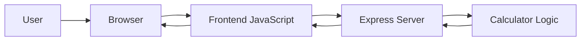
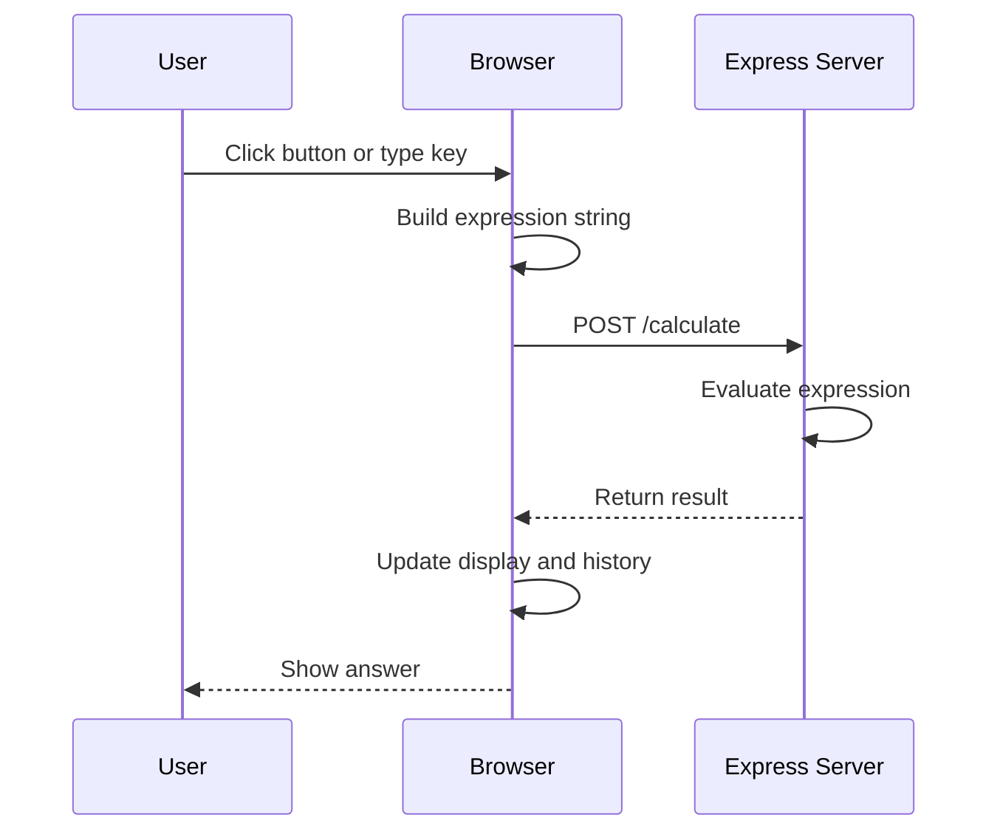
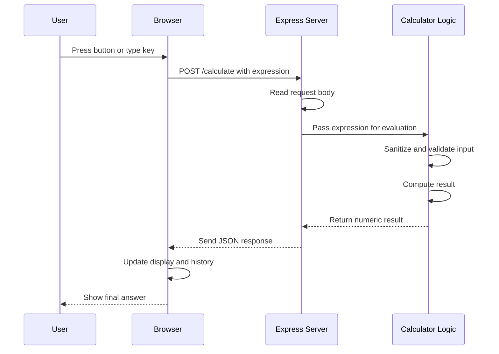

# CougarCalc Documentation

This document explains how the CougarCalc app works in a beginner-friendly way.

## What this app does

CougarCalc is a simple web calculator built with:
- HTML, CSS, and JavaScript for the user interface
- Node.js and Express for the server
- a small test suite to check that calculations work correctly

## Architecture overview

The app is made of a few connected layers:

1. Frontend
   - The calculator interface appears in the browser.
   - HTML defines the page structure.
   - CSS makes it look like a calculator.
   - JavaScript handles button clicks, keyboard input, and display updates.

2. Backend
   - Express is the web server running on Node.js.
   - It listens for requests from the browser.
   - It receives the expression the user entered and returns the result.

3. Data flow
   - The browser collects the user input.
   - The browser sends that input to the server.
   - The server evaluates the calculation.
   - The server sends the result back to the browser.
   - The browser shows the answer and updates history.

### Architecture diagram

## How a calculation works

Here is the basic flow for a calculation:

1. The user clicks a button or types a key.
2. The browser updates the displayed expression.
3. The browser sends the expression to the server.
4. The server evaluates it.
5. The server sends the result back.
6. The browser displays the result and adds it to history.

### Sequence diagram

### More detailed request-flow diagram

A common way to show this kind of app more clearly is a sequence diagram that breaks the server work into smaller steps. This version shows the Express route, the validation step, and the calculator logic separately:

## Main files in the project

- app.js
  - Starts the Express server
  - Defines the /calculate route
  - Serves the web page and static assets

- public/index.html
  - Contains the calculator interface
  - Handles button clicks and keyboard input
  - Displays results and history

- package.json
  - Lists dependencies and scripts such as npm start and npm test

- test/app.test.js
  - Contains automated tests for the calculator behavior

## How the frontend works

The frontend is the part the user sees.

It is responsible for:
- showing the calculator UI
- collecting button and keyboard input
- building the expression string
- sending the expression to the server
- showing the answer and recent history

## How the backend works

The backend is the server-side part of the app.

It is responsible for:
- receiving the expression from the browser
- evaluating the arithmetic
- returning the result as JSON

## How the tests work

The tests in test/app.test.js check that the server returns the correct results for sample expressions.

A typical test flow is:
1. Start the app in a test mode
2. Send a request to the calculator endpoint
3. Check that the response contains the expected result

## Beginner-friendly glossary

- Browser: the program you use to visit websites
- Frontend: the visible part of the app
- Backend: the server-side logic behind the app
- Express: a framework for building web servers with Node.js
- API endpoint: a URL that the app uses to send or receive data
- Request: a message sent from the browser to the server
- Response: the message sent back from the server to the browser
- Route: a path such as /calculate that the server handles

## Summary

CougarCalc is a small but complete example of a web app that uses:
- a browser-based interface
- a Node.js server
- simple arithmetic logic
- automated tests

That makes it a great beginner project for learning how frontend, backend, and testing all connect together.
