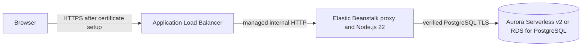

# CougarCalc

CougarCalc is a Node.js 22 and Express calculator with anonymous, browser-specific calculation history in PostgreSQL. Release 03 is prepared for AWS Elastic Beanstalk and Aurora Serverless v2/RDS for PostgreSQL while preserving local PostgreSQL development.

The calculator remains useful when PostgreSQL is not configured or temporarily unavailable. The result is returned immediately, the page clearly states that the calculation was not saved, history returns a safe `503`, liveness remains healthy, and database readiness reports `503` until the complete data path works again.

## Release 03 architecture



These are two separate TLS boundaries:

- Browser-to-load-balancer HTTPS protects the public request and the anonymous history cookie. AWS Certificate Manager provides that certificate. Use `HISTORY_COOKIE_SECURE=true` only after this HTTPS path works.
- Application-to-RDS TLS protects database traffic. `DATABASE_TLS_MODE=verify-full` loads Amazon's public RDS CA bundle and verifies both the certificate chain and the RDS DNS hostname.

The Node process listens over HTTP behind the Beanstalk-managed proxy. TLS is not terminated inside Express.

## Requirements

- Node.js 22.x
- npm and the committed lock file
- PostgreSQL initialized with migration `001` for persistent local history

Node.js 22 is declared in `package.json`. AWS listed the Node.js 22 AL2023 Elastic Beanstalk branch as supported when this release was prepared. Confirm the current branch in `us-west-2` immediately before creating the environment.

## Configuration

The application settings are:

```text
HOST=127.0.0.1
PORT=3000
NODE_ENV=development
HISTORY_COOKIE_SECURE=false
```

Persistent history requires all five database values plus an explicit TLS mode:

```text
DATABASE_HOST=localhost
DATABASE_PORT=5432
DATABASE_NAME=cougarcalc
DATABASE_USER=cougarcalc_app
DATABASE_PASSWORD=replace_with_a_local_password
DATABASE_TLS_MODE=disable
```

For Amazon RDS, use its DNS endpoint and verified TLS:

```text
DATABASE_HOST=your-rds-dns-name
DATABASE_PORT=5432
DATABASE_NAME=cougarcalc
DATABASE_USER=cougarcalc_app
DATABASE_PASSWORD=replace_with_a_unique_disposable_password
DATABASE_TLS_MODE=verify-full
DATABASE_CA_PATH=database/certs/global-bundle.pem
```

`DATABASE_TLS_MODE` accepts only `disable` or `verify-full`. Verified mode requires a DNS hostname and a readable PEM CA file. Local mode must omit `DATABASE_CA_PATH`. The pool allows up to 35 seconds for an Aurora connection, each query uses a 10-second timeout, and the public readiness request has an independent 10-second ceiling. A shared connection attempt can therefore continue after one readiness request returns `503`, allowing a later request to observe Aurora recovery without restarting Node.js.

In AWS, `DATABASE_PASSWORD` is a secret-backed Elastic Beanstalk environment variable. CougarCalc expects one scalar password. If the Secrets Manager value is a JSON object, configure Elastic Beanstalk to select its top-level `password` field (for example, with the supported `:password` JSON-key suffix) rather than injecting the complete object. A parseable JSON object is rejected before PostgreSQL authentication and logged only as `database_password_is_structured_value`. Never commit `.env`, put it in the source ZIP, or copy credentials or secret ARNs/values into logs, screenshots, tests, or documentation.

## Startup modes

If all five `DATABASE_*` connection settings are missing, or only some are present, CougarCalc starts in degraded mode. Logs may list missing variable names but never their values. Invalid database, TLS, or password-shape configuration also starts degraded with a fixed safe category.

When a complete configuration is present, startup creates the normal PostgreSQL repository and runs an initial readiness check. A connection, schema, or permission problem does not prevent Express from listening. Later readiness, history, and save requests use the same repository, so a temporary PostgreSQL outage can recover without a code change. Correcting environment properties normally causes Beanstalk to restart the application and create a properly configured pool.

The only application setting that still intentionally blocks startup when invalid is `HISTORY_COOKIE_SECURE`; it must be the exact text `true` or `false`.

## Database ownership and migrations

The web application never creates or alters tables. Apply the checked-in migration deliberately with the database-owner role:

```sql
\set ON_ERROR_STOP on
SET ROLE cougarcalc_owner;
\i database/migrations/001-create-calculation-history.sql
```

Run Node as `cougarcalc_app`, limited to schema `USAGE`, table `SELECT` and `INSERT`, and identity-sequence `USAGE`. See [initial_db_setup.md](user-helps/initial_db_setup.md) for the full role and grant procedure.

## HTTP behavior

### `POST /calculate`

A saved calculation retains the Release 02 response:

```json
{"result":14}
```

If persistence is unavailable, the calculation still succeeds but is not queued or recovered later:

```json
{
  "result": 14,
  "saved": false,
  "warning": "History is temporarily unavailable; this calculation was not saved."
}
```

### `GET /history`

Returns only the current browser's saved calculations, newest first. It returns a small safe `503` response when history is unavailable.

### `GET /health/live`

Returns `200` and `{"status":"live"}` whenever Express is running. Initial Beanstalk health should use this route so a missing RDS configuration does not replace healthy application instances.

### `GET /health/ready`

Returns `200` and `{"status":"ready"}` only when PostgreSQL connectivity, exact schema, and required runtime permissions are all usable. Otherwise it returns `503` and `{"status":"not ready"}`. Switch Beanstalk health to this route only after RDS and migration validation are complete.

### `GET /diagnostics/instance`

Returns only a stable 12-character one-way hash of the machine hostname. The same marker is added to responses as `X-CougarCalc-Instance`. It helps demonstrate requests moving between temporary Beanstalk targets without returning a hostname, IP address, instance ID, metadata, environment values, secrets, or user data.

Health and diagnostic endpoints do not issue the browser-history cookie.

## Errors and logs

Public database failures use fixed, non-sensitive messages. Server logs use one structured line per event and may contain fixed event names, readiness stages, operation names, safe categories, bounded Node/PostgreSQL codes, retryability, elapsed time, the database port, safe configuration characteristics, and the short instance marker. Repeated identical failures are suppressed; a changed category and recovery are logged as state transitions.

The fixed readiness stages are `connection`, `schema_columns`, `schema_constraint`, `schema_primary_key`, `schema_index`, and `runtime_privileges`. Runtime operation names include `save_calculation`, `retrieve_history`, and `readiness_check`. Logs must never contain database hostnames or usernames, passwords, secret ARNs/values, connection strings, browser cookies, tokens/hashes, calculation expressions, request bodies, SQL text, CA contents, stack traces, raw error messages/objects, or the complete environment.

## Tests and source bundle

Run the complete isolated suite:

```powershell
npm test
```

Run the real local PostgreSQL smoke check after migration `001`:

```powershell
node debug-check.js
```

For the purpose, prerequisites, safety boundaries, and expected output of every automated, degraded, ready-database, recovery, bundle, browser, and AWS validation check, use [release-validation.md](user-helps/release-validation.md).

Create and independently inspect the exact deployment ZIP:

```powershell
npm run bundle
npm run bundle:inspect
```

The deterministic builder uses a runtime allowlist rather than depending on a deployment action to interpret `.ebignore`. Required files are at the ZIP root. Validation rejects Markdown at every depth, `.env`, Git metadata, dependencies, tests, credential-like files, private keys, AWS-access-key-shaped content, missing runtime files, unexpected files, and an extra parent directory. The generated `dist/` ZIP is ignored and must not be committed.

`.ebignore` provides the matching defense for an EB CLI bundle. Documentation remains in GitHub and every Markdown file is excluded from deployment.

The public RDS bundle at `database/certs/global-bundle.pem` came from Amazon's official RDS trust store. It is public, not secret. Before each release and when AWS announces RDS CA rotation, compare the checked-in file with the current official bundle, review the change, rerun TLS tests, rebuild the ZIP, and deploy before the affected certificates expire.
