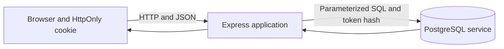

# CougarCalc

CougarCalc is a Node.js and Express calculator with browser-specific calculation history stored in an external PostgreSQL service. Successful calculations remain available after application and browser restarts while the browser retains its anonymous history cookie.

## Architecture



The application runs directly on the host. PostgreSQL runs separately as its own service. Release 2 does not require Docker, a reverse proxy, cloud services, authentication, or an ORM.

## Requirements

- A supported Node.js release with `process.loadEnvFile()` support
- PostgreSQL 17
- The five required database environment variables

```text
DATABASE_HOST=localhost
DATABASE_PORT=5432
DATABASE_NAME=cougarcalc
DATABASE_USER=cougarcalc_app
DATABASE_PASSWORD=your_password
```

`HOST`, `PORT`, `NODE_ENV`, and `HISTORY_COOKIE_SECURE` are optional application settings. Use `HISTORY_COOKIE_SECURE=false` for the current HTTP release and `true` only after HTTPS is deployed. Never commit a populated `.env` file or real credentials.

## First-time setup

Install dependencies:

```powershell
npm ci
```

On Ubuntu, start PostgreSQL and configure it to start after reboot:

```bash
sudo systemctl enable --now postgresql
sudo systemctl status --no-pager postgresql
```

Create the target PostgreSQL database and roles, then run the Release 2 schema initialization as `cougarcalc_owner`:

```sql
\set ON_ERROR_STOP on
SET ROLE cougarcalc_owner;
\i database/migrations/001-create-calculation-history.sql
```

See [initial_db_setup.md](user-helps/initial_db_setup.md) for complete role, permission, Windows, macOS, and Ubuntu instructions.

Copy `.env.example` to `.env`, replace every placeholder, and start the application:

```powershell
Copy-Item .env.example .env
npm start
```

Open <http://localhost:3000>.

See [RunningTheApp.md](RunningTheApp.md) for routine setup, testing, and troubleshooting.

Startup checks connectivity, the required column definitions, validated browser-hash constraint, identity and primary-key configuration, browser-scoped history index, and app role's required privileges. If PostgreSQL is reachable but not ready, CougarCalc exits with a safe message naming the initialization file and application permissions.

## Anonymous browser history

The server generates a 32-byte random token and stores it in the `cougarcalc_history` cookie for 365 days. The cookie is `HttpOnly`, `SameSite=Lax`, and scoped to `/`. PostgreSQL receives only the token's SHA-256 hash.

History belongs to a browser profile, not a verified person:

- Chrome and Edge have separate histories.
- Private browsing has a separate temporary history identity.
- Clearing the cookie starts a new empty history.
- History does not follow someone to another browser or device.

## HTTP API

### `POST /calculate`

Calculates and saves a successful expression for the current browser:

```json
{
  "expression": "2 + 3 * 4"
}
```

Successful response:

```json
{
  "result": 14
}
```

The Release 1 legacy `{ "a": 7, "b": 3, "operation": "+" }` request shape remains supported. Invalid calculations retain their existing `400` responses and are not saved. If PostgreSQL cannot save an otherwise successful calculation, the endpoint returns `503`.

### `GET /history`

Returns only the current browser's saved calculations, newest first:

```json
[
  {
    "id": 2,
    "timestamp": "2026-07-24T18:01:00.000Z",
    "expression": "2 + 3 * 4",
    "result": 14
  }
]
```

### `GET /environment`

Returns the active `NODE_ENV` value, defaulting to `development`.

## Tests

Run:

```powershell
npm test
```

The automated suite injects fake repositories and pools, so it does not require a running PostgreSQL service. It covers browser isolation across an application restart, startup sequencing and cookie configuration, exact schema readiness, and browser calculator input behavior. Before release, also initialize a clean PostgreSQL database with migration `001` and run `node debug-check.js` to verify real connection, scoped persistence, and retrieval.

## Main files

- `app.js` - application factory, routes, startup, and graceful shutdown
- `browser-identity.js` - anonymous token, hash, and cookie handling
- `database.js` - required configuration, PostgreSQL pool, readiness checks, and scoped repository
- `database/migrations/001-create-calculation-history.sql` - complete Release 2 history table, ownership constraint, and scoped index
- `public/index.html` - calculator and browser-specific history UI
- `test/` - calculator, cookie, isolation, migration, configuration, and repository tests

See [ProjectStructureGuide.md](user-helps/ProjectStructureGuide.md) and [db-design.md](user-helps/db-design.md) for more detail.
