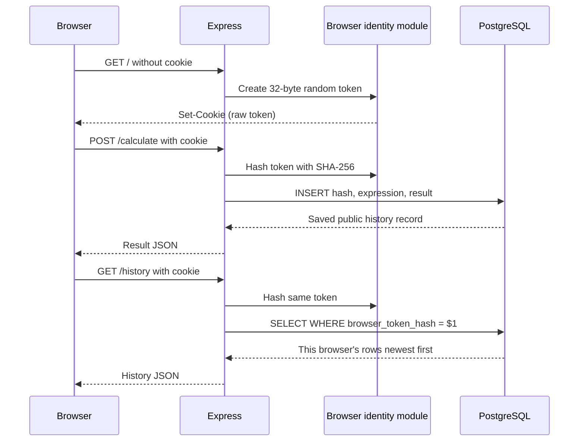

# CougarCalc project structure

```text
cougarcalc/
|-- app.js
|-- browser-identity.js
|-- database-diagnostics.js
|-- database.js
|-- instance-marker.js
|-- debug-check.js
|-- .ebignore
|-- package.json
|-- package-lock.json
|-- .env.example
|-- database/
|   |-- certs/
|   |   `-- global-bundle.pem
|   `-- migrations/
|       `-- 001-create-calculation-history.sql
|-- public/
|   |-- index.html
|   `-- calculator-logic.js
|-- test/
|   |-- app.test.js
|   |-- browser-identity.test.js
|   |-- calculator-logic.test.js
|   |-- database-diagnostics.test.js
|   |-- database.test.js
|   |-- deployment-bundle.test.js
|   |-- instance-marker.test.js
|   `-- migration.test.js
|-- scripts/
|   |-- degraded-smoke.js
|   |-- postgres-recovery-smoke.js
|   `-- deployment-bundle.js
`-- docs/
    `-- user-helps/
        |-- initial_db_setup.md
        `-- release-validation.md
```

## Browser-scoped request flow



The raw token appears only in cookie request/response headers. Repository methods receive only its hash, and public JSON never contains either value.

## `app.js`

- Loads an optional local `.env`.
- Creates the Express application with an injected repository.
- Establishes browser identity before serving the homepage or history APIs.
- Preserves expression and legacy calculation request formats.
- Saves successful calculations with the current browser hash when history is available and explicitly marks an unsaved result during database failure.
- Retrieves only the current browser's newest-first history.
- Starts degraded when database configuration, connectivity, schema, or permissions are unavailable.
- Provides independent liveness and database readiness endpoints.
- Adds a non-secret serving-instance response marker.
- Closes the connection pool during normal process shutdown.

## `browser-identity.js`

- Generates 32 bytes with Node's cryptographic random source and encodes them as base64url.
- Accepts only the exact token format and rejects duplicate, malformed, or oversized cookie input.
- Hashes valid tokens with SHA-256.
- Serializes a 365-day `HttpOnly`, `SameSite=Lax`, `Path=/` cookie.
- Adds `Secure` only when `HISTORY_COOKIE_SECURE=true`.
- Does not collect IP addresses, user agents, fingerprints, or personal identifiers.

## `database.js`

- Treats missing or partial connection variables as an intentional unavailable-history state.
- Strictly validates a complete configuration, explicit `disable` or `verify-full` TLS mode, and the database port.
- Rejects a parseable JSON object supplied as `DATABASE_PASSWORD`; the pool requires one scalar password.
- Creates the `pg` pool with a 35-second Aurora-aware connection timeout and 10-second query timeout.
- Loads the public RDS CA in verified mode and requires certificate and DNS-hostname verification.
- Provides configured and unavailable implementations of the same repository interface.
- Keeps parameterized SQL in one repository.
- Requires a lowercase 64-character token hash for save and history operations.
- Inserts and filters history using placeholders.
- Verifies all five non-null columns, the validated browser-hash constraint, identity, primary key, scoped index, and minimum runtime privileges.
- Treats required privileges as a minimum and does not reject additional privileges.
- Maps database rows to public history objects without the browser hash.

## `database-diagnostics.js`

- Classifies stable Node.js and PostgreSQL error codes into fixed safe categories.
- Formats single-line database events with bounded configuration, readiness-stage, operation, code, retryability, elapsed-time, and instance-marker fields.
- Suppresses repeated identical readiness, operation, and idle-pool failures.
- Logs category changes and recovery transitions without emitting routine success noise.
- Never serializes raw errors, secrets, connection configuration, request/user data, or the complete environment.
- Accepts an injected logger and clock so security and state-transition behavior are directly testable.

The application factory accepts a fake repository and hostname source, allowing HTTP, cookie-isolation, readiness, and instance-marker tests to run without PostgreSQL or developer-machine identity.

## Deployment support

- `instance-marker.js` hashes the machine hostname to a 12-character marker without returning the source.
- `database/certs/global-bundle.pem` is Amazon's public RDS trust bundle.
- `.ebignore` excludes local-only and documentation files for EB CLI workflows.
- `scripts/deployment-bundle.js` creates and inspects the deterministic runtime-only ZIP used for manual and future CI packaging.
- `scripts/degraded-smoke.js` verifies calculator success, unsaved status, liveness, and readiness without database configuration.
- `scripts/postgres-recovery-smoke.js` is an instructor/release-only check that stops and restarts an explicitly configured disposable local PostgreSQL cluster; it must never target RDS, production, or a normal development database.
- `debug-check.js` verifies a ready database path and prints only readiness, save status, history count, and the short instance marker.
- `docs/user-helps/release-validation.md` is the canonical procedure and safety guide for automated, degraded, ready-database, recovery, bundle, browser, and AWS validation.

## Database migrations

- `001-create-calculation-history.sql` creates the complete Release 2 history table, its browser-hash constraint, and the browser-scoped newest-first index.

Release 1 had no database, so Release 2 starts from this single clean-install schema. An administrator runs the migration as `cougarcalc_owner`; Node connects as `cougarcalc_app`. See [initial_db_setup.md](initial_db_setup.md).

## Browser files

`public/index.html` submits calculations, presents the unsaved warning through an accessible live status region, and fetches persisted history on page load and after successful calculations. Normal browser cookie handling is automatic because the requests are same-origin.

`public/calculator-logic.js` contains browser logic that can also be imported by Node tests. After a successful calculation, `beginNextExpression` starts a new expression for digits, decimals, and `(`, or continues from the previous result when an operator is pressed.

## Tests

- `app.test.js` covers calculator compatibility, cookie issuance, separate cookie jars, application-restart persistence, ready/degraded startup, recovery, health, diagnostics, clearing cookies, safe failures, static-file safety, and routes.
- `browser-identity.test.js` covers token entropy, parsing, hashing, cookie attributes, HTTP/HTTPS configuration, reuse, and malformed input.
- `database.test.js` covers missing/partial configuration, verified and disabled TLS, timeouts, exact column/constraint/index readiness, minimum privileges, hash validation, scoped parameterized SQL, ordering, mapping, and pool closure.
- `database-diagnostics.test.js` covers stable error classification, safe fallback codes, secret exclusion, repeated-failure suppression, category changes, and recovery transitions.
- `deployment-bundle.test.js` proves exact ZIP inclusion, deterministic output, root layout, and fail-closed exclusions.
- `instance-marker.test.js` proves deterministic, distinct, non-revealing markers from injected hostnames.
- `migration.test.js` statically verifies that migration `001` creates the complete table, requires a hash, and creates only the scoped index.
- `calculator-logic.test.js` covers initial input normalization, per-operand decimal handling, ordinary formula entry, post-evaluation continuation, result rounding, and non-finite values.

The automated suite cannot prove the catalog queries against a real PostgreSQL server. Before release, follow [release-validation.md](release-validation.md) for the ready-database smoke check, the disposable outage/recovery check when appropriate, bundle inspection, browser isolation, and AWS validation.
