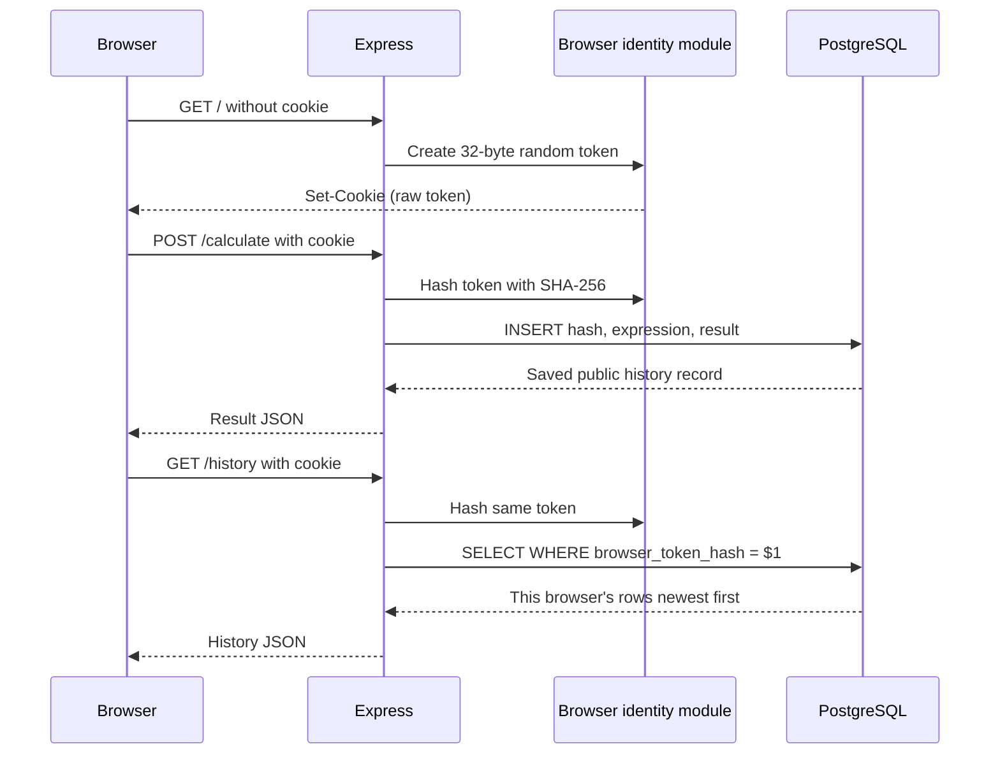

# CougarCalc project structure

```text
cougarcalc/
|-- app.js
|-- browser-identity.js
|-- database.js
|-- debug-check.js
|-- package.json
|-- package-lock.json
|-- .env.example
|-- database/
|   `-- migrations/
|       `-- 001-create-calculation-history.sql
|-- public/
|   |-- index.html
|   `-- calculator-logic.js
|-- test/
|   |-- app.test.js
|   |-- browser-identity.test.js
|   |-- calculator-logic.test.js
|   |-- database.test.js
|   `-- migration.test.js
`-- docs/
    `-- user-helps/
        `-- initial_db_setup.md
```

## Browser-scoped request flow



The raw token appears only in cookie request/response headers. Repository methods receive only its hash, and public JSON never contains either value.

## `app.js`

- Loads an optional local `.env`.
- Creates the Express application with an injected repository.
- Establishes browser identity before serving the homepage or history APIs.
- Preserves expression and legacy calculation request formats.
- Saves every successful calculation with the current browser hash before returning success.
- Retrieves only the current browser's newest-first history.
- Verifies PostgreSQL connectivity and readiness before listening.
- Reports connection failures separately from schema or permission failures.
- Closes the connection pool during normal process shutdown.

## `browser-identity.js`

- Generates 32 bytes with Node's cryptographic random source and encodes them as base64url.
- Accepts only the exact token format and rejects duplicate, malformed, or oversized cookie input.
- Hashes valid tokens with SHA-256.
- Serializes a 365-day `HttpOnly`, `SameSite=Lax`, `Path=/` cookie.
- Adds `Secure` only when `HISTORY_COOKIE_SECURE=true`.
- Does not collect IP addresses, user agents, fingerprints, or personal identifiers.

## `database.js`

- Requires the five `DATABASE_*` variables and validates the database port.
- Creates the `pg` connection pool.
- Keeps parameterized SQL in one repository.
- Requires a lowercase 64-character token hash for save and history operations.
- Inserts and filters history using placeholders.
- Verifies all five non-null columns, the validated browser-hash constraint, identity, primary key, scoped index, and minimum runtime privileges.
- Treats required privileges as a minimum and does not reject additional privileges.
- Maps database rows to public history objects without the browser hash.

The application factory accepts a fake repository, allowing HTTP and cookie-isolation tests to run without PostgreSQL.

## Database migrations

- `001-create-calculation-history.sql` creates the complete Release 2 history table, its browser-hash constraint, and the browser-scoped newest-first index.

Release 1 had no database, so Release 2 starts from this single clean-install schema. An administrator runs the migration as `cougarcalc_owner`; Node connects as `cougarcalc_app`. See [initial_db_setup.md](initial_db_setup.md).

## Browser files

`public/index.html` submits calculations and fetches persisted history on page load and after successful calculations. Normal browser cookie handling is automatic because the requests are same-origin.

`public/calculator-logic.js` contains browser logic that can also be imported by Node tests. After a successful calculation, `beginNextExpression` starts a new expression for digits, decimals, and `(`, or continues from the previous result when an operator is pressed.

## Tests

- `app.test.js` covers calculator compatibility, cookie issuance, separate cookie jars, application-restart persistence, startup sequencing/configuration, clearing cookies, successful-only persistence, safe failures, static-file safety, and routes.
- `browser-identity.test.js` covers token entropy, parsing, hashing, cookie attributes, HTTP/HTTPS configuration, reuse, and malformed input.
- `database.test.js` covers required configuration, exact column/constraint/index readiness, minimum privileges, hash validation, scoped parameterized SQL, ordering, mapping, and pool closure.
- `migration.test.js` statically verifies that migration `001` creates the complete table, requires a hash, and creates only the scoped index.
- `calculator-logic.test.js` covers initial input normalization, per-operand decimal handling, ordinary formula entry, post-evaluation continuation, result rounding, and non-finite values.

The automated suite cannot prove the catalog queries against a real PostgreSQL server. Before release, apply migration `001` to a clean PostgreSQL 17 database, run `node debug-check.js`, restart Node, and complete the two-browser verification in [RunningTheApp.md](../RunningTheApp.md).
